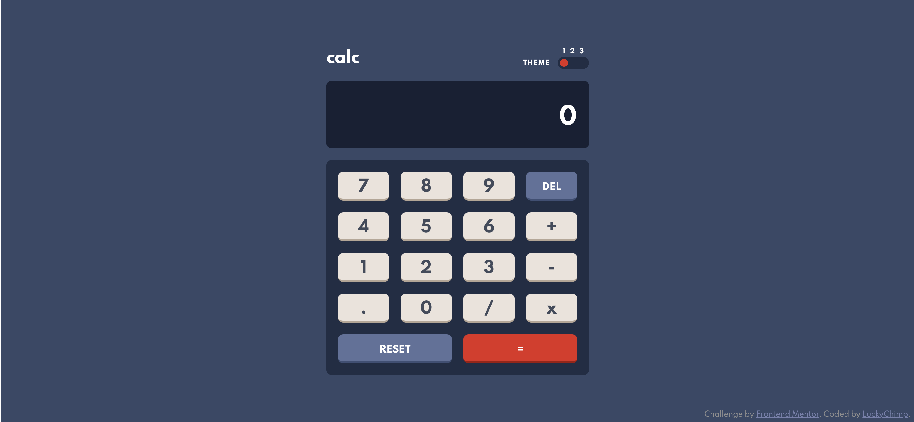

# Frontend Mentor - Calculator app solution

This is a solution to the [Calculator app challenge on Frontend Mentor](https://www.frontendmentor.io/challenges/calculator-app-9lteq5N29). Frontend Mentor challenges help you improve your coding skills by building realistic projects. 

## Table of contents

- [Overview](#overview)
  - [The challenge](#the-challenge)
  - [Screenshots](#screenshots)
  - [Link](#link)
- [My process](#my-process)
  - [Built with](#built-with)
  - [What I learned](#what-i-learned)
  - [Useful resource](#useful-resource)
- [Author](#author)

## Overview

### The challenge

Users are able to:

- See the size of the elements adjust based on their device's screen size
- Perform mathmatical operations like addition, subtraction, multiplication, and division
- Adjust the color theme based on their preference
- **Bonus**: Continue calculating where they left off, even if the tab is already closed but the browser window is still open
- **Bonus**: Always start with their favorite theme, because it will be saved even if the entire browser window is closed

### Screenshots

#### Theme 1


#### Theme 2


#### Theme 3


### Link

- Solution URL: [https://luckychimp.github.io/calculator/](https://luckychimp.github.io/calculator/)

## My process

### Built with

- Semantic HTML5 markup
- SCSS for clean, easy and less CSS
- custom HTML data attribute in combination with SCSS mixin and maps to handle the three different themes
- Flexbox
- CSS Grid
- JavaScript: localStorage and sessionStorage to store the current calculation result and the current theme

### What I learned

In this project I learned how to use HTML, SCSS and JavaScript to add different color themes to the website.

First, you should set a data-theme attribute in HTML for the body element with the name of the default theme. This is how I did it:
```html
<body data-theme="theme-1">
```
Then in JavaScript, for example when you click on a button or toggle button, you can set this data-theme attribute according to the name of the chosen theme:
```js
document.body.dataset.theme = 'theme-2';
```
Then in SCSS it is best to create one or more files with the themes and their respective style rules. One file could look like this:
```css
$theme1: (
    'clr_example': #3a4764,
    'fs_example': 24px
);

$theme2: (
  'clr_example': #3a4764,
  'fs_example': 24px
);

$theme3: (
  'clr_example': #3a4764,
  'fs_example': 24px
);
```
You can then access them from another SCSS file after importing them there with 
```css
@use './themes';
```
With the help of a mixin and the map function, the previously defined variables can now be inserted according to the currently selected theme via the data-theme attribute of the body element:
```css
@use 'sass:map';

@mixin theme($name, $map) {
    body[data-theme=#{$name}] {
        background-color: map.get($map, 'clr_example');

        .text {
          font-size: map.get($map, 'fs_example');
        }
    }
            
```
Now you only have to include the mixin for each theme:
```css
@include theme('theme-1', themes.$theme1);
@include theme('theme-2', themes.$theme2);
@include theme('theme-3', themes.$theme3);
```

### Useful resource

- [Theming with Sass: An SCSS Tutorial](https://www.toptal.com/sass/theming-scss-tutorial) - This helped me to understand how to implement different color themes (or other themes in the future) in scss

## Author

- Frontend Mentor - [@LuckyChimp](https://www.frontendmentor.io/profile/LuckyChimp)